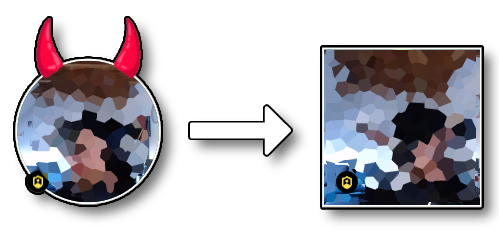

# ImproveSpatial

## What it does

It removes the avatar decorations and change the video/avatar view from circle to rectangle.

## Installation

### Dependencies

You need to install the browser addon `Tampermonkey` for your browser of choice:

| Browser | Addon-URL |
|---------|-------|
| Chome | https://chrome.google.com/webstore/detail/tampermonkey/dhdgffkkebhmkfjojejmpbldmpobfkfo |
| Firefox | https://addons.mozilla.org/firefox/addon/tampermonkey/ |

### Adding the script

After the installation of `Tampermonkey` click on it's icon and choose `Create a new script...`

Now copy the contents of the `ImproveSpatial.user.js` file from this repository to the editor and save.

The script should be activated when you refresh the spatial website. If not, you can activate it via the Tampermonkey addon icon.